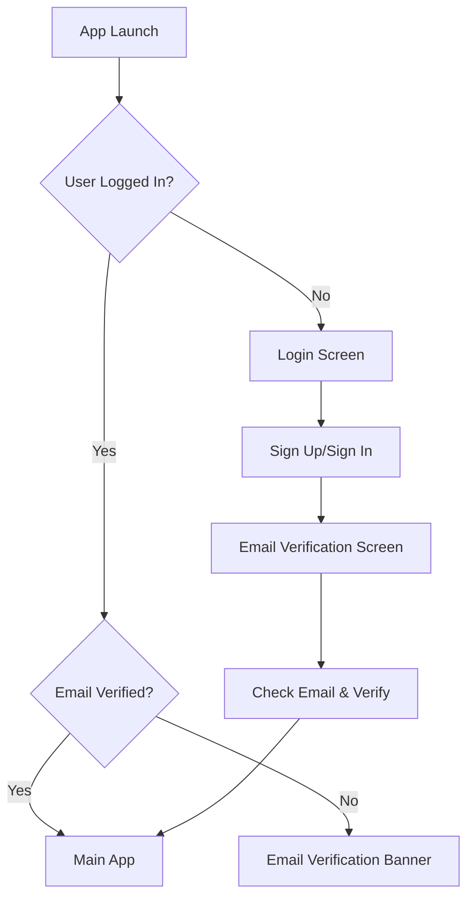

# Sport Centre Booking App - Technical Documentation

## Table of Contents
1. [Architecture Overview](#architecture-overview)
2. [Project Structure](#project-structure)
3. [Authentication System](#authentication-system)
4. [Data Models](#data-models)
5. [State Management](#state-management)
6. [Firebase Integration](#firebase-integration)
7. [UI Components](#ui-components)
8. [Validation System](#validation-system)
9. [Navigation Flow](#navigation-flow)
10. [Setup and Installation](#setup-and-installation)
11. [Build and Deployment](#build-and-deployment)

## Architecture Overview

### Technology Stack
- **Framework**: Flutter 3.24+ (Dart)
- **Backend**: Firebase (Authentication, Firestore, Storage)
- **State Management**: Provider Pattern
- **UI**: Material Design 3
- **Architecture Pattern**: MVC with Provider

### Core Components
```
┌─────────────────┐    ┌─────────────────┐    ┌─────────────────┐
│   Presentation  │    │    Business     │    │      Data       │
│     Layer       │◄──►│     Logic       │◄──►│     Layer       │
│                 │    │                 │    │                 │
│ • Screens       │    │ • Providers     │    │ • Services      │
│ • Widgets       │    │ • Models        │    │ • Firebase      │
│ • Validation    │    │ • Utils         │    │ • Local Storage │
└─────────────────┘    └─────────────────┘    └─────────────────┘
```

## Project Structure

```
lib/
├── main.dart                 # App entry point
├── firebase_options.dart     # Firebase configuration
│
├── models/                   # Data models
│   ├── activity.dart        # Activity entity
│   ├── app_user.dart        # User profile model
│   ├── booking.dart         # Booking entity
│   └── user_profile.dart    # Extended user data
│
├── providers/                # State management
│   ├── auth_provider.dart   # Authentication state
│   └── booking_provider.dart # Booking state
│
├── services/                 # Business logic & API calls
│   ├── auth_service.dart    # Firebase Auth operations
│   ├── activity_service.dart # Activity CRUD
│   ├── booking_service.dart  # Booking operations
│   └── user_service.dart    # User profile management
│
├── screens/                  # UI screens
│   ├── auth/                # Authentication screens
│   │   ├── login_screen.dart
│   │   └── email_verification_screen.dart
│   ├── home/                # Main app screens
│   ├── booking/             # Booking flow
│   ├── profile/             # User profile
│   └── admin/               # Admin panel
│
├── widgets/                  # Reusable UI components
│   ├── auth/                # Auth-related widgets
│   ├── navigation/          # Navigation components
│   └── activity/            # Activity widgets
│
└── utils/                    # Utilities & helpers
    ├── colors.dart          # App color scheme
    ├── constants.dart       # App constants
    ├── validation_utils.dart # Form validation
    └── activity_helpers.dart # Activity utilities
```

## Authentication System

### Features
- **Email/Password Authentication** with Firebase Auth
- **Email Verification** (automatic on signup)
- **Password Reset** via email
- **Strong Password Requirements** (8+ chars, mixed case, numbers, symbols)
- **Role-Based Access Control** (User, Admin, Club Owner)
- **Session Management** with automatic token refresh

### Authentication Flow


### Implementation Details

#### AuthService (`lib/services/auth_service.dart`)
- Handles all Firebase Authentication operations
- Automatic email verification on registration
- User document creation in Firestore
- Error handling with user-friendly messages

#### AuthProvider (`lib/providers/auth_provider.dart`)
- Manages authentication state across the app
- Provides reactive UI updates
- Handles user profile loading
- Role-based permission checking

### Code Example
```dart
// Register new user with automatic email verification
static Future<UserCredential?> registerWithEmail(
  String email,
  String password,
  String displayName, {
  bool isClubOwner = false,
}) async {
  final result = await _auth.createUserWithEmailAndPassword(
    email: email.trim(),
    password: password,
  );
  
  // Create user profile and send verification
  if (result.user != null) {
    await _createUserDocument(result.user!, displayName, isClubOwner: isClubOwner);
    await result.user!.sendEmailVerification();
  }
  
  return result;
}
```

## Data Models

### AppUser Model
```dart
class AppUser {
  final String uid;
  final String email;
  final String displayName;
  final DateTime createdAt;
  final DateTime lastLoginAt;
  final String role;
  final bool isActive;
  
  // Points and rewards
  final int totalPoints;
  final int availablePoints;
  final int lifetimePointsEarned;
  
  // Membership
  final bool isMember;
  final String? membershipType;
  final DateTime? membershipExpiry;
  
  // Permissions
  final bool isClubOwner;
  
  // Profile data
  final List<String> bookingHistory;
  final List<String> upcomingBookings;
  final String profileImageUrl;
}
```

### Activity Model
```dart
class Activity {
  final String id;
  final String name;
  final String description;
  final String category;
  final double price;
  final int duration; // minutes
  final int maxParticipants;
  final int currentParticipants;
  final String location;
  final String imageUrl;
  final DateTime startTime;
  final DateTime endTime;
  final bool isActive;
  final String createdBy; // Club owner ID
  final int pointsReward;
}
```

### Booking Model
```dart
class Booking {
  final String id;
  final String activityId;
  final String userId;
  final DateTime bookingDate;
  final BookingStatus status;
  final double totalPrice;
  final int pointsUsed;
  final int pointsEarned;
  final DateTime createdAt;
  final String? notes;
}

enum BookingStatus {
  confirmed,
  cancelled,
  completed,
  waitlist
}
```

## State Management

### Provider Pattern Implementation
The app uses the Provider pattern for state management, providing:
- **Reactive UI updates** when state changes
- **Centralized business logic** in provider classes
- **Easy testing** and mocking capabilities
- **Memory efficient** state handling

### Key Providers

#### AuthProvider
- Manages user authentication state
- Handles user profile data
- Provides role-based access control
- Notifies UI of authentication changes

#### BookingProvider
- Manages booking flow state
- Handles booking operations
- Calculates pricing and points
- Tracks booking history

### Usage Example
```dart
// In main.dart
MultiProvider(
  providers: [
    ChangeNotifierProvider(create: (_) => AuthProvider()),
    ChangeNotifierProvider(create: (_) => BookingProvider()),
  ],
  child: MaterialApp(...)
)

// In UI components
Consumer<AuthProvider>(
  builder: (context, authProvider, child) {
    return authProvider.isLoggedIn 
        ? MainNavigation() 
        : LoginScreen();
  },
)
```

## Firebase Integration

### Services Used
1. **Firebase Authentication**
   - Email/password authentication
   - Email verification
   - Password reset

2. **Cloud Firestore**
   - User profiles
   - Activity data
   - Booking records
   - Real-time updates

3. **Firebase Storage** (planned)
   - User profile images
   - Activity images

### Security Rules
```javascript
// Firestore Security Rules
rules_version = '2';
service cloud.firestore {
  match /databases/{database}/documents {
    // Users can read/write their own data
    match /users/{userId} {
      allow read, write: if request.auth != null 
          && request.auth.uid == userId;
    }
    
    // Activities are publicly readable
    match /activities/{activityId} {
      allow read: if true;
      allow write: if request.auth != null 
          && isClubOwner(request.auth.uid);
    }
    
    // Bookings are user-specific
    match /bookings/{bookingId} {
      allow read, write: if request.auth != null 
          && request.auth.uid == resource.data.userId;
    }
  }
  
  function isClubOwner(userId) {
    return exists(/databases/$(database)/documents/users/$(userId))
        && get(/databases/$(database)/documents/users/$(userId)).data.isClubOwner == true;
  }
}
```

## UI Components

### Screen Hierarchy
```
AuthWrapper
├── LoginScreen (unauthenticated)
└── MainNavigation (authenticated)
    ├── HomeScreen
    ├── BookingsScreen
    ├── RewardsScreen
    ├── ProfileScreen
    ├── AdminPanel (admin only)
    └── ClubOwnerPanel (club owners only)
```

### Key Widgets

#### EmailVerificationBanner
- Shows persistent notification for unverified users
- Provides quick access to verification screen
- Automatically hides when email is verified

#### PasswordStrengthIndicator
- Real-time password strength analysis
- Visual progress bar with color coding
- Requirements checklist with live updates

#### ActivityCard
- Displays activity information
- Handles booking actions
- Shows availability and pricing

### Design System
- **Material Design 3** principles
- **Consistent color scheme** (Teal primary)
- **Responsive layouts** for different screen sizes
- **Accessibility support** with semantic widgets

## Validation System

### Password Requirements
- Minimum 8 characters
- At least 1 uppercase letter
- At least 1 lowercase letter  
- At least 1 number
- At least 1 special character

### Name Validation
- 2-40 characters allowed
- Letters, spaces, hyphens, apostrophes only
- Real-time character counting

### Implementation
```dart
// ValidationUtils class provides all validation logic
class ValidationUtils {
  static String? validatePassword(String? password) {
    if (password == null || password.isEmpty) return 'Required';
    if (password.length < 8) return 'Minimum 8 characters';
    if (!password.contains(RegExp(r'[A-Z]'))) return 'Need uppercase';
    // ... additional checks
    return null; // Valid
  }
  
  static int getPasswordStrength(String password) {
    // Returns 0-100 strength score
  }
}
```

## Navigation Flow

### App Navigation Structure
```
Main App
├── Bottom Navigation
│   ├── Home (Activities)
│   ├── My Bookings
│   ├── Rewards
│   └── Profile
├── Admin Panel (conditional)
└── Club Owner Panel (conditional)

Authentication Flow
├── Login Screen
├── Email Verification Screen
└── Password Reset Dialog
```

### Route Management
- Uses Flutter's built-in navigation
- Modal routes for authentication
- Bottom navigation for main app sections
- Conditional routes based on user roles

## Setup and Installation

### Prerequisites
- Flutter SDK 3.24+
- Dart SDK 3.0+
- Android Studio / Xcode (for mobile development)
- Firebase account and project

### Installation Steps

1. **Clone Repository**
```bash
git clone <repository-url>
cd sport_centre_booking
```

2. **Install Dependencies**
```bash
flutter pub get
```

3. **Firebase Setup**
   - Create Firebase project
   - Enable Authentication (Email/Password)
   - Setup Firestore Database
   - Add configuration files:
     - `android/app/google-services.json`
     - `ios/Runner/GoogleService-Info.plist`

4. **Run Application**
```bash
flutter run
```

### Environment Configuration
```dart
// firebase_options.dart (auto-generated)
static const FirebaseOptions currentPlatform = FirebaseOptions(
  apiKey: "your-api-key",
  authDomain: "your-project.firebaseapp.com",
  projectId: "your-project-id",
  // ... other config
);
```

## Build and Deployment

### Debug Build
```bash
flutter run --debug
```

### Release Build
```bash
# Android
flutter build apk --release
flutter build appbundle --release

# iOS  
flutter build ios --release
```

### Testing
```bash
# Unit tests
flutter test

# Integration tests
flutter test integration_test/
```

### Performance Optimization
- **Lazy loading** of user data
- **Efficient state management** with Provider
- **Image caching** for activity images
- **Pagination** for large data sets
- **Offline support** with Firestore cache

## Security Considerations

1. **Authentication Security**
   - Strong password requirements enforced
   - Email verification mandatory
   - Secure token management

2. **Data Protection**
   - Firestore security rules
   - User data isolation
   - Role-based access control

3. **Input Validation**
   - Client-side validation for UX
   - Server-side validation in Firestore rules
   - SQL injection prevention (NoSQL)

## Troubleshooting

### Common Issues

1. **Firebase Configuration**
   - Ensure `google-services.json` is in correct location
   - Verify SHA fingerprints for Android
   - Check bundle ID for iOS

2. **Authentication Issues**
   - Verify email/password is enabled in Firebase Console
   - Check network connectivity
   - Clear app data if persistent issues

3. **Build Issues**
   - Run `flutter clean && flutter pub get`
   - Update Flutter SDK if needed
   - Check platform-specific requirements

### Debug Tools
- Flutter Inspector for UI debugging
- Firebase Console for backend monitoring
- Provider DevTools for state management
- Performance Profiler for optimization

---

This technical documentation provides comprehensive coverage of the Sport Centre Booking app's architecture, implementation details, and setup procedures. For user-facing documentation, see the User Guide.